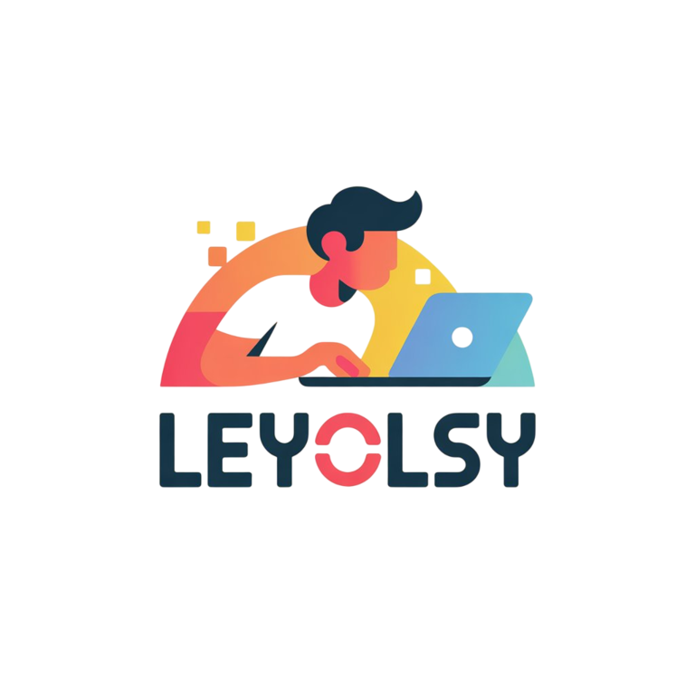

# Hello, I'm @leyolsy 🐧

I'm here to explore coding with a twist—leveraging AI for my projects 🦄🐯 
My approach is unconventional, but hey, who says learning can't be fun? 🦊

→ **Relying on AI for coding** 🐧 
→ *Curious to see where this AI-powered journey leads* 🦄

> **Disclaimer**: These projects are AI-assisted and may unintentionally resemble others' work.  
> If you notice any issues, please reach out—I’m happy to review and remove any content as needed.  
> Thanks for your understanding! ➾

> *(Don't take inspiration from my AI-only approach! Learn to code, and you might just end up looking cool doing it (⌐■_■) 🦊)*
